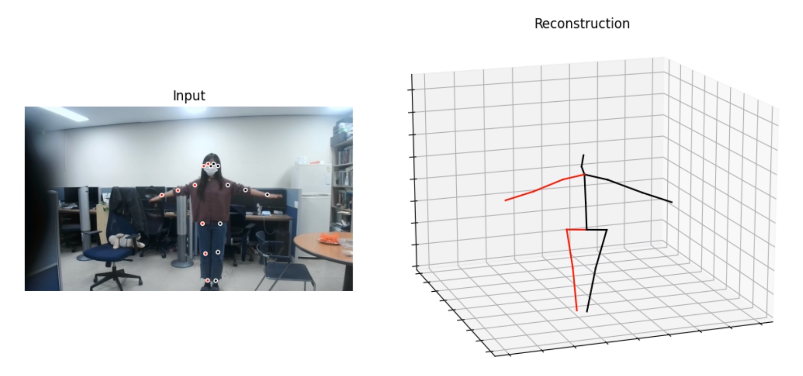
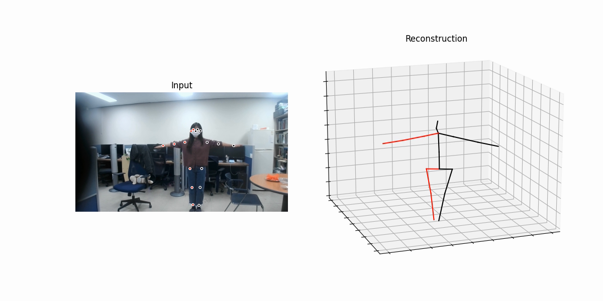
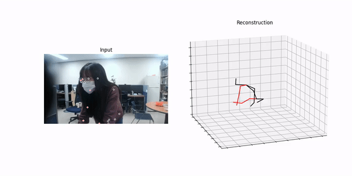

# GUIDING TO USE 3D HUMAN POSE ESTIMATION

GitHub Url: https://github.com/phan-kimngan/pose3d_exam

Student Name: **Phan Kim Ngan**

ID: **217161**

Paper: **3D human pose estimation in video with temporal convolutions and semi-supervised training**

## Setup Source Code

+ Download source code and pre-trained models


```bash
git clone https://github.com/facebookresearch/VideoPose3D.git

cd VideoPose3D

mkdir checkpoint
cd checkpoint
wget https://dl.fbaipublicfiles.com/video-pose-3d/pretrained_h36m_cpn.bin
wget https://dl.fbaipublicfiles.com/video-pose-3d/pretrained_humaneva15_detectron.bin
wget https://dl.fbaipublicfiles.com/video-pose-3d/pretrained_h36m_detectron_coco.bin
cd ..
```

+ Install packages in Ubuntu

```bash
# Install ffmpeg for converting video format
sudo apt install ffmpeg
# Install video codec to play video mp4
sudo apt install ubuntu-restricted-extras
```


## Install Environment 

+ Install Anconda3

  https://www.anaconda.com/products/individual

+ Setup pose3d environment and  corresponding packages

```bas
# pose3d enviromment
conda activate base
conda create -y -c anaconda -n pose3d python=3.8 ipykernel

# kernel for jupyter-lab
conda activate pose3d
python -m pip install --upgrade pip
python -m ipykernel install --user --name pose3d --display-name "pose3d"

# pytorch
pip install torch==1.10.1+cu113 torchvision==0.11.2+cu113 torchaudio==0.10.1+cu113 -f https://download.pytorch.org/whl/cu113/torch_stable.html

# other packages
pip install matplotlib pillow scipy scikit-image scikit-learn pandas
pip install opencv-python opencv-contrib-python

# dectron2
python -m pip install 'git+https://github.com/facebookresearch/detectron2.git'
```


## Structure of Project VideoPose3D

```
VideoPose3D
├── common
│   └── ...
├── checkpoints
│   ├── pretrained_h36m_cpn.bin
│   ├── pretrained_humaneva15_detectron.bin
│   └── pretrained_h36m_detectron_coco.bin
├── data
│   ├── prepare_data_2d_custom.py
│   ├── data_2d_custom_myvideos.npz  <-- create custom dataset myvideos from detron2 keypoints (test.mp4.npz)
│   └── ...
├── images
│   └── ...
├── inference
│   ├── infer_video_d2.py
│   └── ...
├── run.py
├── inputs
│   ├── test.mp4      <-- input with 30 fps (first submit)
│   ├── testwithoutaudio.mp4 <-- using ffmpeg to remove audio from test.mp4
│   ├── test_50fps.mp4  <-- using ffmpeg to change frame rate from testwithoutaudio.mp4
│   └── ...
├── outputs
│   ├── test.mp4.npz  <-- keypoints infered from detron2 of test.mp4(first submit)
│   ├── test_50fps.mp4.npz  <-- keypoints infered from detron2 of test_50fps.mp4
│   └── ...
└── ...
```


## Demo on custom video

+ Make **inputs** and **outputs** directories at **VideoPose3D**

+ Put demo video into inputs such as **test.mp4**

+ Activate **pose3d** environment

+ Video Preprocessing

Check frame in **test.mp4** (**first submit**) and results of *ffprobe* gives 29.99fps ~ **30fps** for **test.mp4**

```bash
ffprobe -i inputs/test.mp4 -show_streams -hide_banner | grep "nb_frames"
#Output
Input #0, mov,mp4,m4a,3gp,3g2,mj2, from 'inputs/test.mp4':
  Metadata:
    major_brand     : mp42
    minor_version   : 0
    compatible_brands: mp41isom
    creation_time   : 2021-12-30T13:20:39.000000Z
  Duration: 00:00:17.10, start: 0.000000, bitrate: 18061 kb/s
    Stream #0:0(und): Video: h264 (Main) (avc1 / 0x31637661), yuvj420p(pc), 1920x1080 [SAR 1:1 DAR 16:9], 17891 kb/s, 29.99 fps, 30 tbr, 30k tbn, 60 tbc (default)
    Metadata:
      creation_time   : 2021-12-30T13:20:39.000000Z
      handler_name    : VideoHandler
      encoder         : AVC Coding
    Stream #0:1(und): Audio: aac (LC) (mp4a / 0x6134706D), 48000 Hz, stereo, fltp, 195 kb/s (default)
    Metadata:
      creation_time   : 2021-12-30T13:20:39.000000Z
      handler_name    : SoundHandler
nb_frames=512
nb_frames=792
```

Try using video with **50fps** and named **test_50fps.mp4**. Remove audio from **test.mp4** with named **testwithoutaudio.mp4** before change frame rate.

```bash
  ffmpeg -i inputs/test.mp4 -map 0 -map -0:a inputs/testwithoutaudio.mp4
  fmpeg -i inputs/testwithoutaudio.mp4 -filter "minterpolate='fps=50'" -crf 0 inputs/test_50fps.mp4
```

Check **test_50fps.mp4** 
```bash
ffprobe -i inputs/test_50fps.mp4 -show_streams -hide_banner | grep "nb_frames"
#Output
Input #0, mov,mp4,m4a,3gp,3g2,mj2, from 'inputs/test_50fps.mp4':
  Metadata:
    major_brand     : isom
    minor_version   : 512
    compatible_brands: isomiso2avc1mp41
    encoder         : Lavf58.29.100
  Duration: 00:00:17.02, start: 0.000000, bitrate: 74134 kb/s
    Stream #0:0(und): Video: h264 (High 4:4:4 Predictive) (avc1 / 0x31637661), yuvj420p(pc), 1920x1080 [SAR 1:1 DAR 16:9], 74132 kb/s, 50 fps, 50 tbr, 12800 tbn, 100 tbc (default)
    Metadata:
      handler_name    : VideoHandler
nb_frames=851

```

+ Infer keypoints from all videos in inputs by command

```bash
# inputs : VideoPose3D/inputs/test.mp4
# outputs: VideoPose3D/outputs/test.mp4.npz (keypoints of all frames)

# At VideoPose3D directory
cd inference
python infer_video_d2.py 									\
	--cfg COCO-Keypoints/keypoint_rcnn_R_101_FPN_3x.yaml 	\
	--output-dir ../outputs 								\
	--image-ext mp4 										\
	../inputs
```

+ Create a custom dataset

```bash
# inputs : VideoPose3D/outputs/test.mp4.npz (keypoints of all frames)
# outputs: VideoPose3D/data/data_2d_custom_myvideos.npz (custom dataset myvideos from detron2 keypoints - test.mp4.npz)

# At VideoPose3D directory
cd data
python prepare_data_2d_custom.py -i ../outputs/ -o myvideos
```

+ Render a custom video and exporting coordinates

```bash
python run.py 										\
	-d custom 										\ # custom dataset
	-k myvideos 									\ # custom dataset containing keypoints of all preprocessing videos
	-arc 3,3,3,3,3									\ 
	-c checkpoint 									\ # checkpoint directory containing pretrained weights
	--evaluate pretrained_h36m_detectron_coco.bin 	\ # pretrained model using coco
	--render 										\
	--viz-subject test.mp4 							\  # filename in inputs directory
	--viz-action custom 							\  # custom dataset
	--viz-camera 0 									\
	--viz-video inputs/test_50fps.mp4 				\  # input video
	--viz-output outputs/output_50fps.mp4 			\  # output rendering video with 2D + 3D keypoints
	--viz-size 6
```

+ Final Result

*First Submittion without using ffmpeg for **test.mp4** with **30Hz** and **output.mp4** with **30Hz**.*

```bash
ffprobe -i outputs/output_50fps.mp4 -show_streams -hide_banner | grep "nb_frames"
#Output
Input #0, mov,mp4,m4a,3gp,3g2,mj2, from 'outputs/output.mp4':
  Metadata:
    major_brand     : isom
    
    minor_version   : 512
    compatible_brands: isomiso2avc1mp41
    encoder         : Lavf58.29.100
  Duration: 00:00:17.07, start: 0.000000, bitrate: 2910 kb/s
    Stream #0:0(und): Video: h264 (High) (avc1 / 0x31637661), yuv420p, 1200x600, 2907 kb/s, 30 fps, 30 tbr, 15360 tbn, 60 tbc (default)
    Metadata:
      handler_name    : VideoHandler
nb_frames=512
```




*2nd Submittion using ffmpeg for **test.mp4** with **30Hz** and **output_50fps.mp4** with **50Hz**.*

```bash
ffprobe -i outputs/output_50fps.mp4 -show_streams -hide_banner | grep "nb_frames"
#Output
Input #0, mov,mp4,m4a,3gp,3g2,mj2, from 'outputs/output_50fps.mp4':
  Metadata:
    major_brand     : isom
    minor_version   : 512
    compatible_brands: isomiso2avc1mp41
    encoder         : Lavf58.29.100
  Duration: 00:00:17.02, start: 0.000000, bitrate: 2884 kb/s
    Stream #0:0(und): Video: h264 (High) (avc1 / 0x31637661), yuv420p, 1200x600, 2879 kb/s, 50 fps, 50 tbr, 12800 tbn, 100 tbc (default)
    Metadata:
      handler_name    : VideoHandler
nb_frames=851
```






## References

```
@inproceedings{pavllo:videopose3d:2019,
  title={3D human pose estimation in video with temporal convolutions and semi-supervised training},
  author={Pavllo, Dario and Feichtenhofer, Christoph and Grangier, David and Auli, Michael},
  booktitle={Conference on Computer Vision and Pattern Recognition (CVPR)},
  year={2019}
}
```
